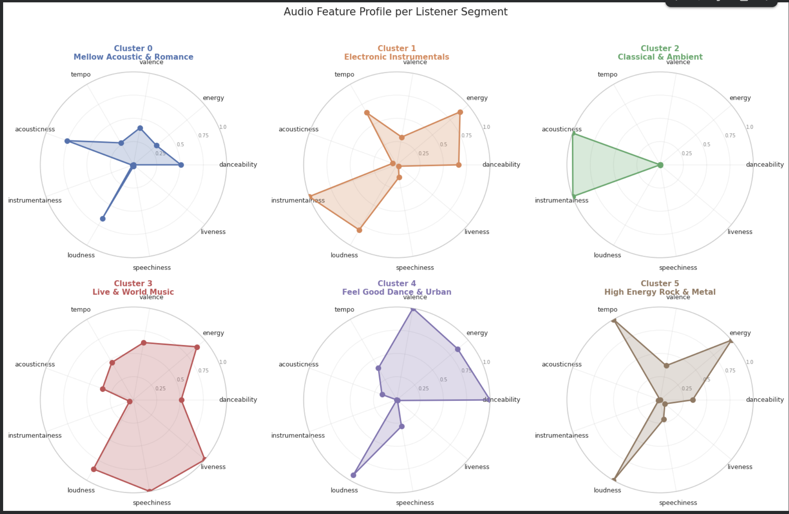
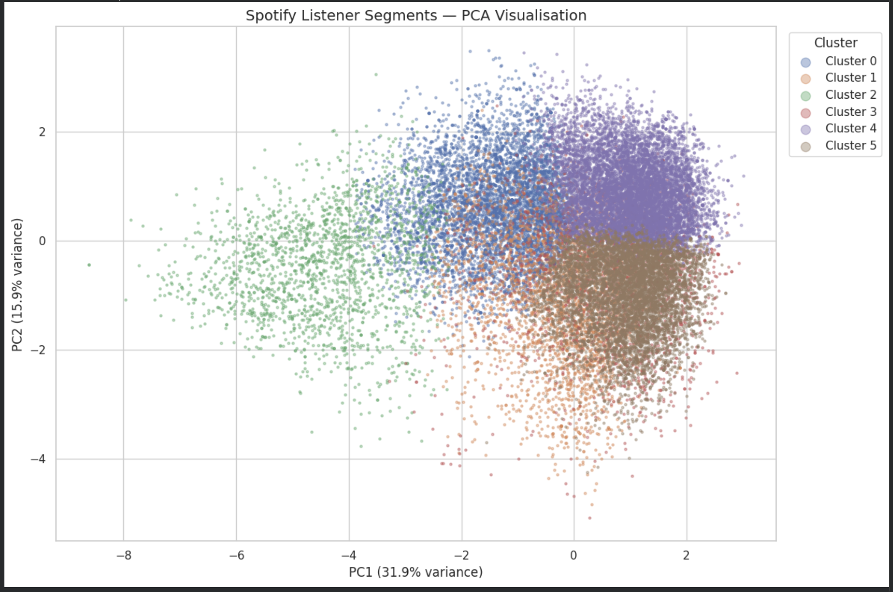
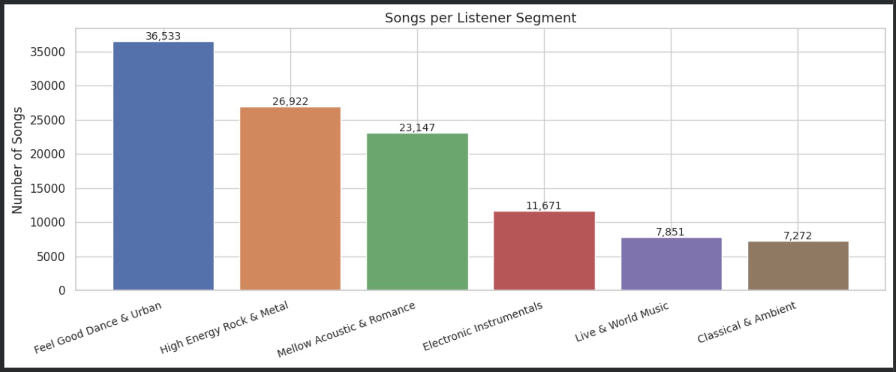

# Spotify Listener Segmentation

## Overview
Unsupervised machine learning project to segment 114,000 Spotify 
songs into 6 distinct listener personas using K-Means clustering.

## Tools & Libraries
Python, pandas, numpy, scikit-learn, matplotlib, seaborn

## Dataset
- 114,000 songs across 114 genres
- Source: Kaggle — Spotify Tracks Dataset
- 9 audio features used: danceability, energy, valence, tempo,
  acousticness, instrumentalness, loudness, speechiness, liveness

## Methodology
1. Data cleaning & EDA
2. Feature scaling with StandardScaler
3. Optimal K selection via Elbow Method + Silhouette Score
4. KMeans clustering (K=6)
5. PCA visualisation
6. Cluster profiling & naming using genre validation

## Results — 6 Listener Segments

| Cluster | Segment Name              | Size   | Top Genres                        |
|---------|---------------------------|--------|-----------------------------------|
| 0       | Mellow Acoustic & Romance | 20.4%  | Tango, Jazz, Singer-songwriter    |
| 1       | Electronic Instrumentals  | 10.3%  | Techno, IDM, Trance, Study        |
| 2       | Classical & Ambient       |  6.4%  | Classical, Sleep, Ambient, Piano  |
| 3       | Live & World Music        |  6.9%  | Samba, Pagode, Sertanejo, MPB     |
| 4       | Feel Good Dance & Urban   | 32.2%  | Reggaeton, Latino, Hip-hop, Salsa |
| 5       | High Energy Rock & Metal  | 23.7%  | Metalcore, Heavy-metal, Grunge    |

## Key Visuals

### Radar Charts — Audio Profile per Segment

### PCA — Cluster Separation

### Segment Distribution

## Key Finding
Cluster 3 (Live & World Music) was an unexpected discovery —
identified purely through a liveness score of 0.751, later
validated by Brazilian live music genres dominating the cluster.

## Business Recommendations
- Cluster 4 (Feel Good Dance & Urban) — prime target for ad-supported tier
- Cluster 2 (Classical & Ambient) — target with HiFi lossless audio upsell
- Cluster 3 (Live & World Music) — target with concert ticket promotions
- Cluster 1 (Electronic Instrumentals) — target with Focus/Study playlists
- Cluster 0 (Mellow Acoustic & Romance) — target with late night/mood mixes
- Cluster 5 (High Energy Rock & Metal) — target with gym/workout playlists